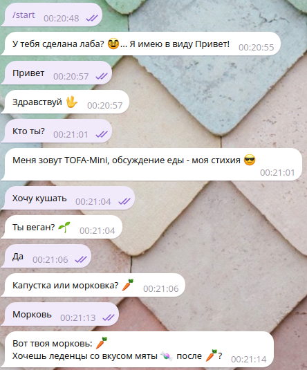
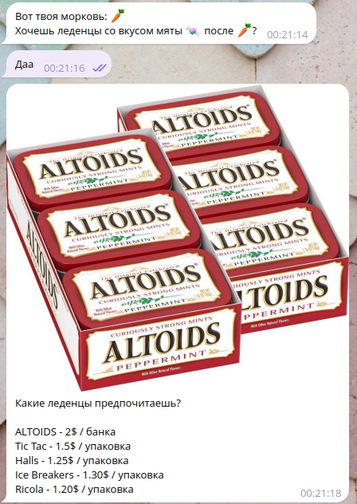
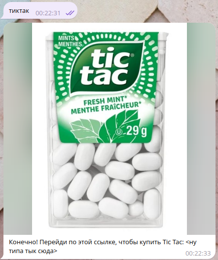

# FakeCurseBot

## 🤡 Бот для упрощения защиты курсового проекта по "Искусственный интеллект в мобильных системах, Часть 2 (семестр 4)"

----------

## ⚠️ Дисклеймер

Используйте данный бот на свой страх и риск. Авторка репозитория не несёт ответственности за любой причинный моральный или физический ущерб связанный с использованием данного репозитория / фрагментов кода.

⚠️ **Не используйте** сообщения в представленных в данном репозитории файлах `fakes.json` и `fakes_ru.json` Перепишите под свои сообщения!

----------

## ❓ Зачем

Бот необходим для решения проблем с кривой работой курсового проекта. Бот позволяет заменить "машинное обучение" регулярными выражениями, что делает работоспособность бота более надежной. Т.е. вы можете **заранее** задать сценарий того, что будете спрашивать у бота и что бот должен отвечать, без "сюрпризов" на защите 😎

||||
|--------------------------------------|-----------------------------------|---------------------------------------|

----------

## 🏗️ Использование и запуск бота

1. Установите Python версии **3.9** или выше. Работоспособность протестирована только на версии **3.11.8**.
2. Клонируйте данный репозиторий

    ```shell
    git clone https://github.com/F33RNI/fake-curse-bot.git
    ```

3. Создайте и запустите виртуальную среду

    ```shell
    python -m venv venv

    # Для Linux
    source venv/bin/activate

    # Для Windows
    venv\Scripts\activate.bat
    ```

4. Установите необходимые зависимости

    ```shell
    pip install -r requirements.txt
    ```

5. Измените файл `fakes.json` под свои нужды (**также, посмотрите пример `fakes_ru.json`**)
   1. `logs` - сообщения логов

        Тут нужно изменить каждое сообщение на то что в вашем курсаче. В самом начале загружается файл dialogues.txt, поэтому будут логи `dialogues_loading` -> `dialogues_filtering` -> `dialogues_structuring` -> `dialogues_sort` -> `dialogues_shuffle` -> `dialogues_done`.

        Далее, будут выведены логи из `after_dialogues`. Каждое сообщение здесь должно иметь структуру `"сообщение|задержка"`, где `задержка` - время в секундах (может быть не целым числом), на которое скрипт будет спать после вывода `сообщение`. Нужно это для большей реалистичности происходящего. Например, `"Обучение классификатора намерений...|5", "Обучение завершено!|0"` выведет сообщение *Обучение классификатора намерений*, подождёт 5 секунд и выведет *Обучение завершено!*

        Все остальные сообщения выводятся по мере необходимости.

        **⚠️ ВАЖНО:** при редактировании сообщений, убедитесь, что аргументы форматирования (`{вот_такая_структура}`, например: `{user_id}`) не нарушены. Они могут быть в любой последовательности, но должны быть обязательно!

   2. `failures` - фразы о том, что бот не понимает написанного. В курсовой работе они обычно записаны в AIML-файл. Тут это массив из строк, где каждое сообщение будет выбираться на рандом. **Вызываются такие сообщения**, только в том случае, если не найдено намерение (по регулярному выражению) **и** не удалось подобрать ответ из **dialogues.txt**
   3. `intents` - основные сообщения. Каждый интент имеет такую структуру

    ```json
    "любое_название_интента": {
        "request": "регулярное выражение, которому должен соотвествовать текст, отправленный боту",
        "responses": [
            "Ответ бота 1",
            "Ответ бота 2",
            "Ещё один ответ который будет выбран из этого массива на рандом"
        ],
        "topic_current": "any",
        "topic_next": "keep",
        "voice": true,
        "image": "путь/к/изображению/которое/нужно/прикрепить/к/тексту.jpg",
        "sticker_file_id": "ID стикера (длинная строка которая обычно начинается с CAA)"
    },
    ```

      - `request` - Отправленное пользователем сообщение будет протестировано этим регулярным выражением. Если проверка пройдена, будет использован данный интент. Для проверки регулярного выражения, можно использовать сайт <https://regexr.com/>. Т.е. бот будет по очереди просматривать каждый интент и тестировать отправленное боту сообщение указанным регулярным выражением. Как только проверка пройдена, бот покажен нужные логи и отправит нужное сообщение
  
        > Пример регулярного выражения для сообщения приветствия: `.*([пП]риве|[sS]tart|дравству).*`. Работает это так: `.*` - любой символ любое количество раз (какие-то слова / символы перед приветствием), `([пП]риве|[sS]tart|дравству)` - приветствие должно содержать одно из этих слов, `.*` - любые символы / слова после приветствия.

    ⚠️ Все остальные параметры (`responses`, `topic_current`, `topic_next`, `voice`, `image`, `sticker_file_id`) **НЕ ОБЯЗАТЕЛЬНЫ!**

      - `responses` - Либо массив для выбора любого ответа на рандом (пример: `"responses": ["Ответ 1", "Ответ 2"]`), либо строка для одного фиксированного ответа (пример: `"responses": "Только 1 возможный ответ"`). **`responses` не обаятелен в случае использования `sticker_file_id`. Если указаны и `responses` и `sticker_file_id`, то в начале будет отправлено сообщение, а потом стикер**
      - `topic_current` и `topic_next` - Это темы сообщения, которые используются **только для логов** `intent_topic` и `topic_next`. Ни для чего, кроме логов это не используется
      - `voice` - Укажите `"voice": true` для того, чтобы отправлять голосовые сообщения вместе с текстом. Если этот параметр отсутствует, или имеет значение `false`, то текст из `responses` будет отправлен как обычное сообщение
      - `image` - Укажите путь к любому изображению, которое нужно отправить вместе с текстом из `responses`. Если этот параметр отсутствует, то текст из `responses` будет отправлен как обычное сообщение
      - `sticker_file_id` - ID стикера, который нужно отправить после (или вместо сообщения из `responses`). Пример: `CAACAgIAAxkBAAEqJVZl7pZpdVgpeZEKpHrCycEDxI-DnwACJwAD66cYLV3WPUWU1cLiNAQ`. Чтобы узнать ID стикера, можно скинуть его этому боту: <https://t.me/RawDataBot> (ID стикера будет в самом конце в `"file_id": "..."`). Для того, чтобы не отправлять стикеры, уберите `sticker_file_id` целиком.

6. Если нужно изменить логику работы бота, можете отредактировать скрипт `main.py` (основные действия происходят в функции `_parse_and_send_fake_message()`)
7. Создайте бота, написав `/newbot` в <https://t.me/BotFather>. Создайте имя, которое может показать что это ваша работа. Придумайте юзернэйм бота (должен оканчиваться на `bot`). Скопируйте HTTP API Token и вставьте в `BOT_API_KEY` вверху скрипта `main.py`

### 🕶 Как использовать бота на защите

1. На защите показываете свой код из курсача. Он должен находиться в другом файле
2. В терминале запускаете скрипт `main.py` (`python main.py`) и говорите что это тот самый код (**⚠️ но код этого бота ни в коем случае не показываете**). Показываете логи загрузки и ожидайте запуска бота
3. Пишите в бот сообщения так, чтобы они наверняка прошли нужное регулярное выражение. И можно показать терминал, где будут фейковые логи о распознавании интент, темах и т.д.
4. Боту **можно писать сообщения из dialogues.txt, он будет на них отвечать**. Если же сообщение не подходит по регулярному выражению и не удалось найди диалог в dialogues.txt, то будет выведена фраза из `failures`.
